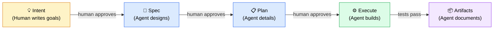

<div align="center">

# 🎯 Intent-First

**Stop letting AI agents guess. Start with intent.**

A dead-simple agentic workflow that forces AI coding agents to think before they code.

**Intent → Spec → Plan → Execute → Artifacts**

Human writes the "what". Agent figures out the "how". Human approves each step.

[](LICENSE)

</div>

---

## The Problem

AI coding agents jump straight into writing code. They guess what you want, make wrong assumptions, and produce work you have to redo. The bigger the task, the worse it gets.

## The Solution

**Intent-First** is a 5-stage workflow where humans stay in control and agents do the heavy lifting — in the right order.



Each stage **locks** after approval. No going back. No scope creep. No guessing.

## Install

One command. Auto-detects your OS and AI tools.

```bash
curl -fsSL https://raw.githubusercontent.com/shc261392/intent-first/main/install.sh | bash
```

<details>
<summary><b>What does this do?</b></summary>

1. Detects which AI coding tools you use (Copilot, Cursor, Claude Code, etc.)
2. Installs workflow rules to each tool's config location
3. Installs prompt templates for each workflow stage
4. Installs a tiny CLI for creating and validating workflows

Nothing is modified outside your project directory. Everything goes into tool-specific config dirs and `.intent-first/`.
</details>

### Tool-Specific Locations

| Tool | Rules Location | Prompts Location |
|------|---------------|-----------------|
| **GitHub Copilot** (VS Code / CLI) | `.github/copilot-instructions.md` | `.github/prompts/` |
| **Cursor** | `.cursor/rules/intent-first.md` | `.cursor/prompts/` |
| **Claude Code** | `CLAUDE.md` | `.claude/prompts/` |
| **Windsurf** | `.windsurfrules` | `.windsurf/prompts/` |
| **Aider** | `.aider.rules.md` | — |
| **Cline / Roo** | `.clinerules` | — |
| **Antigravity** | `.antigravity/rules/intent-first.md` | `.antigravity/prompts/` |

### Manual Install

Don't want to run a script? Copy files manually:

1. Copy `rules/RULES.md` content into your AI tool's instruction file
2. Copy `prompts/wf-*.prompt.md` into your tool's prompts directory
3. Copy `templates/` to `.intent-first/templates/` in your project
4. Copy `cli/intent-first` to `.intent-first/bin/intent-first`

## How It Works

### 1. 💡 Intent — You write the "what"

```bash
.intent-first/bin/intent-first new
# Creates workflow/001/ with template files
```

Edit `workflow/001/intent.md` with your goals. Write in plain language. Focus on **what** you want and **why**, not how to build it.

### 2. 📐 Spec — Agent designs the "how"

Tell your AI agent:

```
/wf-spec 001
```

The agent reads your intent and drafts a technical specification: architecture decisions, interfaces, quality gates, and deliverables. **You review and approve** before anything gets built.

### 3. 📋 Plan — Agent details every step

```
/wf-plan 001
```

The agent creates a file-by-file, function-by-function implementation plan from the approved spec. Every function signature, every test case, every file path — planned before a single line of code is written. **You review and approve.**

### 4. ⚙️ Execute — Agent builds it

```
/wf-execution 001
```

The agent implements exactly what was planned. Progress is tracked in real-time. Any deviation from the plan requires your explicit approval.

### 5. 📦 Artifacts — Agent documents outcomes

```
/wf-artifacts 001
```

The agent documents what was built, captures design decisions, records lessons learned, and suggests follow-up work.

## The Rules

These rules make Intent-First work. They're automatically installed into your AI tool's config.

| Rule | Why |
|------|-----|
| **No auto-proceed** | Agent never advances to next stage without your approval |
| **Stage locking** | Approved stages can't be edited — no scope creep |
| **80% confidence threshold** | Agent must ask you when it's unsure |
| **Decision tracking** | Every decision records who, when, and why |
| **100% plan compliance** | Deviations during execution need your approval |
| **No reversal** | Forces careful thinking at each stage |

## CLI Reference

```bash
intent-first new              # Create next workflow (auto-numbered)
intent-first validate         # Validate all workflows
intent-first validate 001     # Validate specific workflow
intent-first list             # List all workflows with status
intent-first help             # Show help
```

Add to `package.json`:

```json
{
  "scripts": {
    "wf:new": ".intent-first/bin/intent-first new",
    "wf:validate": ".intent-first/bin/intent-first validate",
    "wf:list": ".intent-first/bin/intent-first list"
  }
}
```

Or any task runner / Makefile — it's just a bash script with zero dependencies.

## Customizing Templates

Templates live in `.intent-first/templates/`. Edit them to match your team's conventions. The CLI uses these when creating new workflows.

## When to Use This

✅ **Use Intent-First for:**
- Features that touch 3+ files
- Architectural changes
- Anything where "just do it" leads to rework
- Work that needs an audit trail

❌ **Don't use for:**
- One-line fixes
- Simple config changes
- Quick documentation edits

## FAQ

**Q: Does this work with [my AI tool]?**
A: If your tool reads markdown instruction files (most do), yes. The installer covers Copilot, Cursor, Claude Code, Windsurf, Aider, Cline, and Antigravity. For others, just copy `rules/RULES.md` into your tool's instruction file.

**Q: What if the agent makes a mistake in execution?**
A: It documents the issue in `execution.md`, proposes a fix, and waits for your approval. No silent deviations.

**Q: Can I skip stages?**
A: No. That's the point. Skipping stages is how AI agents produce garbage.

**Q: What if I need to change the spec after planning?**
A: Create a new workflow. The old one stays as-is for reference. This sounds strict, but it prevents the "just one more change" death spiral.

**Q: Is this overkill for small tasks?**
A: Yes! Only use it for complex work. For small tasks, just talk to your AI agent normally.

## License

[GPL-3.0](LICENSE)
