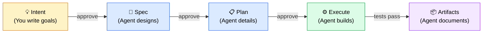

<div align="center">

# Intent-First


**A lightweight local protocol that stops AI agents from guessing.**

Markdown files + a tiny CLI. Zero dependencies. Works with any AI coding tool.

**Intent → Spec → Plan → Execute → Artifacts**

[](LICENSE)

</div>

---

## What Is This?

Intent-First is a local agent enforcement protocol. It gives your AI coding agent a 5-stage process: you write the intent, the agent designs, plans, builds, and documents — with your approval between each stage.

It's not a framework, not a SaaS product, not a team collaboration tool. It's just markdown files and a bash script that keep your agent on track.

**The core insight:** the bottleneck isn't code generation — it's intent capture. If the agent knows exactly what you want, and you've signed off on the design and plan, execution becomes the easy part.

### Why This, Why Now

The best thing about Intent-First is that you can **drop it into any project in 30 seconds** and remove it just as fast if something better comes along. AI evolves at a pace where no tool is guaranteed to be useful by year-end. Intent-First doesn't fight that — it embraces it. It's a lightweight, easy-to-iterate protocol that you adopt today and replace tomorrow if the landscape shifts.

In this era of agentic coding, nothing beats **fast iteration and ease of adoption**. No config files to maintain, no vendor lock-in, no migration path to worry about. It's markdown and bash. If it stops being useful, run `intent-first implode` and it's gone.



## Install

```bash
curl -fsSL https://raw.githubusercontent.com/shc261392/intent-first/main/install.sh | bash
```

This auto-detects your AI tools (Copilot, Cursor, Claude Code, Windsurf, Aider, Cline, Antigravity) and installs rules + prompts into each tool's config location. A small CLI goes to `~/.intent_first/bin/`.

Workflow data (`workflow/`) is **ephemeral and gitignored** — like chat history, it structures your process but isn't version-controlled. Commit specific outcomes explicitly when you want to keep them.

<details>
<summary><b>Manual install</b></summary>

1. Copy `rules/RULES.md` content into your AI tool's instruction file
2. Copy `prompts/wf-*.prompt.md` into your tool's prompts directory
3. Copy `templates/` to `.intent-first/templates/`
4. Copy `cli/intent-first` to `~/.intent_first/bin/intent-first`

</details>

<details>
<summary><b>Tool-specific locations</b></summary>

| Tool | Rules | Prompts |
|------|-------|---------|
| **GitHub Copilot** | `.github/copilot-instructions.md` | `.github/prompts/` |
| **Cursor** | `.cursor/rules/intent-first.md` | `.cursor/prompts/` |
| **Claude Code** | `CLAUDE.md` | `.claude/prompts/` |
| **Windsurf** | `.windsurfrules` | `.windsurf/prompts/` |
| **Aider** | `.aider.rules.md` | — |
| **Cline / Roo** | `.clinerules` | — |
| **Antigravity** | `.antigravity/rules/intent-first.md` | `.antigravity/prompts/` |

</details>

## Quick Start

### 1. Create a workflow

```bash
intent-first new            # → workflow/1/
intent-first new add-auth   # → workflow/add-auth/
```

No name? Auto-numbered. Got a name? Use it. The command stays short either way.

### 2. Write your intent

Edit `workflow/1/s1_intent.md`. Write **what** you want and **why** — not how to build it.

### 3. Walk through the stages

Tell your agent:

```
/wf-spec 1          # Agent drafts spec from your intent → you approve
/wf-plan 1          # Agent creates implementation plan → you approve
/wf-execution 1     # Agent builds it, tracking progress in real-time
/wf-artifacts 1     # Agent documents outcomes and lessons learned
```

Each stage produces a markdown file. Each requires your approval before the next begins.

## Stage Locking

When you approve a stage, the agent **automatically locks it** by running `intent-first lock <ID> <stage>` via terminal. This makes the file read-only at the OS level — `chmod`. No IDE plugin, no git hook, no agent can silently edit a locked stage.

```bash
# Automatic — agents run this after you approve:
intent-first lock 1 spec        # s2_spec.md → read-only

# Manual override if needed:
intent-first unlock 1 spec      # revert to writable
```

The `validate` command catches drift — it warns when a file says "Approved — Locked" but is still writable.

## The Rules

Installed automatically into your AI tool's config:

| Rule | Effect |
|------|--------|
| **No auto-proceed** | Agent waits for your approval between stages |
| **Stage locking** | Approved stages become read-only (OS-enforced) |
| **70% confidence threshold** | Agent asks you when it's unsure |
| **Decision tracking** | Who decided, when, and why |
| **100% plan compliance** | Deviations need your explicit approval |
| **No reversal** | Locked stages are immutable — start a new workflow instead |

## YOLO Mode

YOLO mode is for when you want the benefit of a structured flow — spec, plan, execute, artifacts — but want to skip all manual review for high-confidence work. The agent still thinks through every stage; it just doesn't wait for your approval unless it's unsure.

```
/wf-yolo 1
/wf-yolo add-auth Add OAuth2 login with GitHub provider
```

The agent runs all stages in one pass, **auto-approving when confidence is ≥85%** and pausing when it drops below. Every auto-decision is tagged `[YOLO-AUTO]` and logged in artifacts.

## CLI Reference

```bash
intent-first new [name]            # Create workflow (auto-number or named)
intent-first lock <ID> <STAGE>     # Lock stage file (chmod read-only)
intent-first unlock <ID> <STAGE>   # Unlock stage file
intent-first validate [ID]         # Check workflow integrity
intent-first list                  # Show all workflows with status
intent-first implode               # Remove all intent-first files
intent-first help                  # Show help
```

Stages: `intent`, `spec`, `plan`, `execution`, `artifacts` (or `1`–`5`).

## When to Use This

**Use it** for features touching 3+ files, architectural changes, anything where "just do it" leads to rework.

**Skip it** for one-line fixes, config changes, quick docs edits. Just talk to your agent normally.

## Model Guidance

| Stage | Reasoning depth | Model tier |
|-------|----------------|------------|
| Spec / Plan | Deep — architecture, trade-offs, precise signatures | Strongest available |
| Execution | Moderate — follows a locked plan | Mid-tier |
| Artifacts | Light — structured documentation | Lightweight |

## FAQ

<details>
<summary><b>Does this work with my AI tool?</b></summary>
If it reads markdown instruction files, yes. The installer covers Copilot, Cursor, Claude Code, Windsurf, Aider, Cline, and Antigravity. For others, copy <code>rules/RULES.md</code> into your tool's config.
</details>

<details>
<summary><b>Can I skip stages?</b></summary>
No. That's the point. Use <code>/wf-yolo</code> if you want speed — it still runs all stages but auto-approves at high confidence.
</details>

<details>
<summary><b>What if I need to change the spec after planning?</b></summary>
Create a new workflow. The old one stays for reference. This prevents scope creep.
</details>

<details>
<summary><b>Why is workflow data gitignored?</b></summary>
Workflow files are ephemeral process artifacts. Commit specific outcomes explicitly when you want to preserve them.
</details>

<details>
<summary><b>How does auto-locking work?</b></summary>
The stage prompts instruct agents to run <code>intent-first lock &lt;ID&gt; &lt;stage&gt;</code> via terminal after approval. This sets the file read-only via <code>chmod</code>. The OS enforces it — no plugin or hook needed. <code>unlock</code> is there if you need it.
</details>

<details>
<summary><b>Is this a security layer? Can the agent bypass locking?</b></summary>
No, this is <strong>not</strong> zero-trust security. The agent can run <code>intent-first unlock</code> — nothing technically stops it. Intent-First assumes agents are capable of getting the job done most of the time. The purpose of stage locking is to add a <strong>structural guardrail</strong> that helps agents work as intended and prevents scope creep (which happens very easily in agentic coding). Think of it as a seatbelt, not a prison wall — it's there to pull the AI back when it misfires, not to defend against a hostile agent.
</details>
